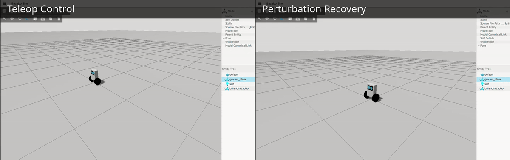
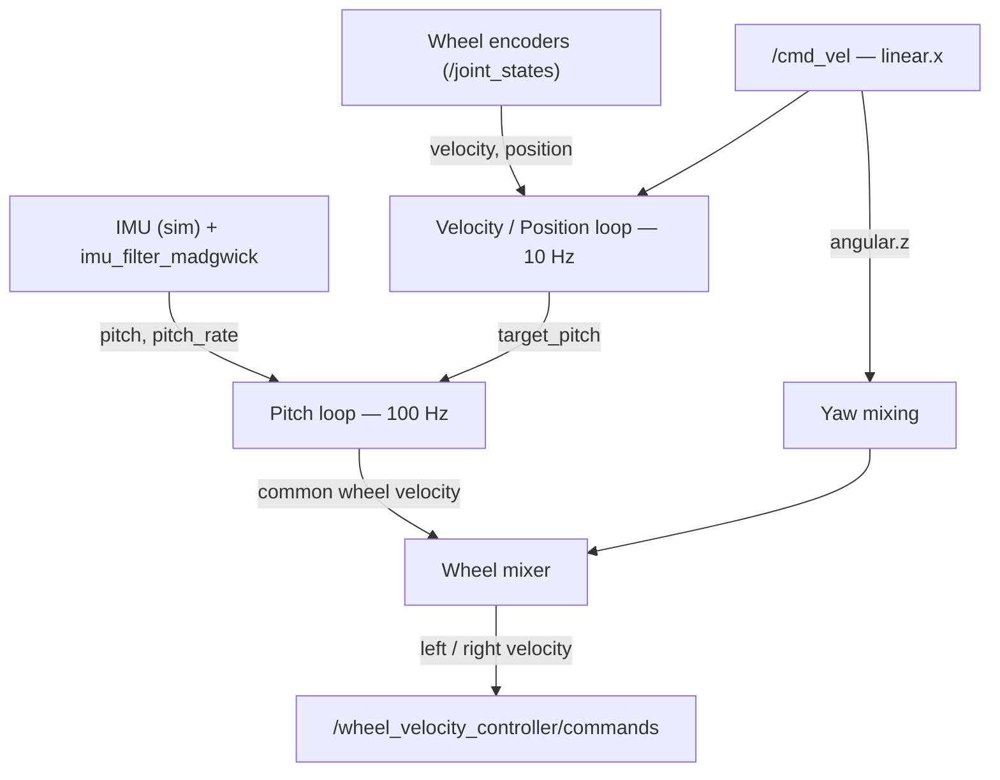
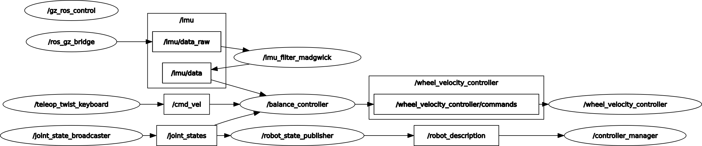

# Self-Balancing Robot

A two-wheeled, self-balancing robot simulated in **Gazebo (Harmonic)** on **ROS 2 Jazzy**, controlled by a cascaded PID stack (pitch --> velocity --> position) with teleop and position-hold, built on the standard `ros2_control` hardware-abstraction layer.

<!-- 
  Demo: balance test + teleop, stitched together.
  Drop the file at docs/media/demo.gif (or .mp4) and this will render on GitHub.
-->


## Overview

The goal of this project was to build a working inverted-pendulum-on-wheels robot end to end: model it, simulate it with realistic physics, fuse IMU data into a usable pitch estimate, and design a cascaded controller that balances, holds a position, and responds to velocity/turn commands — the same architecture (and largely the same interfaces) a real self-balancing robot would use.

**Stack:** ROS 2 Jazzy · Gazebo Harmonic (`gz-sim`) · `ros2_control` / `gz_ros2_control` · `imu_filter_madgwick`

## Features

- **URDF/xacro model** — simple box/cylinder geometry with proper collision and inertia, spawned in Gazebo via `gz_ros2_control`
- **IMU-based pitch estimation** — simulated IMU --> `imu_filter_madgwick` --> orientation quaternion --> pitch extracted via quaternion-to-Euler
- **Cascaded PID control**
  - **Pitch loop** (100 Hz, inner) — the balance loop
  - **Velocity loop** (10 Hz, outer) — regulates forward speed, outputs a pitch offset (feed-forward + feedback lean)
  - **Position-hold loop** — latches and holds a position from wheel odometry when no drive command is active
- **Teleop** — drives from `/cmd_vel`, with acceleration-limited (jerk-free) linear and angular ramping, and automatic hand-off into position-hold once a command stops
- **Yaw control** — differential wheel mixing with an available-headroom cap, so turning never fights the balance command for authority
- **Fall detection** — zeroes all loop state and commands the wheels to stop if pitch exceeds a safety threshold
- **Dockerized dev environment** — `Dockerfile` + `docker-compose.yml` + VS Code devcontainer, pinned to ROS 2 Jazzy

## How it works


Wheel velocity is commanded through `ros2_control`'s `velocity_controllers/JointGroupVelocityController` — the same interface a real motor driver would expose — rather than driving Gazebo directly, so the controller code isn't sim-specific.

The diagram above shows the controller's *internal* logic; the graph below is the *actual* running ROS graph, generated with `rqt_graph`, confirming the wiring matches.



## Package layout

```
src/
├── sbr_description/   # URDF/xacro, ros2_control + Gazebo plugin config, RViz config
├── sbr_bringup/        # Launch files, world, IMU bridge config, controller gains
└── sbr_controller/     # balance_controller node (pitch/velocity/position/yaw PID)
```

## Requirements

- Ubuntu 24.04 + ROS 2 Jazzy + Gazebo Harmonic, **or** Docker (recommended — see below)
- If installing natively: `ros-jazzy-ros2-control`, `ros-jazzy-ros2-controllers`, `ros-jazzy-gz-ros2-control`, `ros-jazzy-imu-tools`

## Build & run

### Option A — Docker (recommended)

```bash
cd docker
docker compose up --build
```
Or open the repo in VS Code and **Reopen in Container** (`.devcontainer/devcontainer.json` is set up already). Once inside the container:
```bash
colcon build --symlink-install
source install/setup.bash
```

### Option B — Native install

```bash
colcon build --symlink-install
source install/setup.bash
```

### Run the simulation

```bash
ros2 launch sbr_bringup sbr_gazebo.launch.xml
```
This spawns the robot in Gazebo, starts `robot_state_publisher`, the IMU bridge and filter, `ros2_control` (`joint_state_broadcaster` + `wheel_velocity_controller`), and the balance controller. The robot should stand up and hold position on its own.

To inspect just the URDF (no physics), use:
```bash
ros2 launch sbr_description display.launch.xml
```

### Drive it

```bash
ros2 run teleop_twist_keyboard teleop_twist_keyboard
```
Stop sending a command and the robot automatically latches into position-hold at wherever it stopped.

### Disturbance Recovery Test

A simple disturbance test is included to check how the balance controller responds to external perturbations. The test applies alternating pitch torques to the robot through Gazebo's persistent wrench interface and clears each torque after a fixed duration.

The current test applies `+0.25 N.m` and `-0.25 N.m` torques for `0.25 s`. After each disturbance, the test waits for the robot to stabilize before applying the next one.

Run the test with:

```bash
ros2 run sbr_controller balance_test --ros-args -p use_sim_time:=true
```


I would **not call `0.25 N.m for 0.25 s` the "absolute limit" in the README**. You experimentally showed that it repeatedly works and that `0.25 N.m for 0.4 s` eventually fails. So "demonstrated disturbance" or "practical recovery test" is more defensible.

Also update your package layout from:

```text
sbr_controller/     # balance_controller node
```

## Tuning

All gains and safety limits live in one place: [`src/sbr_bringup/config/balance_controller_param.yml`](src/sbr_bringup/config/balance_controller_param.yml) — separate sections for the pitch, velocity, position, and yaw loops, plus teleop ramp rates and safety limits (`fall_angle`, `max_velocity`, `max_pitch_offset`).

## Roadmap / known limitations

- Assumes flat ground; no slope/terrain handling
- No heading-hold when idle (yaw isn't corrected while holding position, only while actively commanded)
- `wheel_velocity_controller` uses the now-deprecated `velocity_controllers/JointGroupVelocityController` — a future pass could migrate to `forward_command_controller`
- Not yet tested on real hardware

## License

<!-- Add a LICENSE file at the repo root and name it here, e.g. MIT -->
This project is licensed under the [MIT License](LICENSE).
